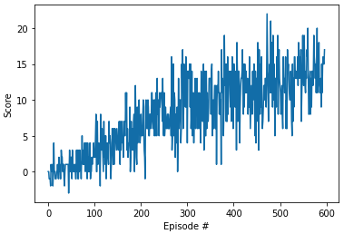

[//]: # (Image References)

[image1]: https://user-images.githubusercontent.com/10624937/42135619-d90f2f28-7d12-11e8-8823-82b970a54d7e.gif "Trained Agent"

# Project 1: Navigation

### Introduction

For this project, an agent is trained to navigate (and collect bananas!) in a large, square world.  

![Trained Agent][image1]

A reward of +1 is provided for collecting a yellow banana, and a reward of -1 is provided for collecting a blue banana.  Thus, the goal of the agent is to collect as many yellow bananas as possible while avoiding blue bananas.  

The state space has 37 dimensions and contains the agent's velocity, along with ray-based perception of objects around agent's forward direction.  Given this information, the agent has to learn how to best select actions.  Four discrete actions are available, corresponding to:
- **`0`** - move forward.
- **`1`** - move backward.
- **`2`** - turn left.
- **`3`** - turn right.

The task is episodic, and in order to solve the environment, the agent must get an average score of +13 over 100 consecutive episodes.

### Algorithm

The agent is a Deep Q network with
* two fully connected + RELU hidden layers, i.e. both of them containing 64 neurons
* one output layer with 4 action neurons
* a replay buffer of 100000 experience tuples
* a 'local' network that only learns every 4 time steps, with an ADAM optimiser with learning rate LR=0.0005 applied on the MSE between predicted Q targets and expected Q targets and using an epsilon-greedy action selection policy with an epsilon decaying from 1.0 to 0.01 with an epsilon decay rate of 0.995
* The Q targets are estimated using a discount factor gamma=0.99
* a 'target' network that updates its weights using an interpolation with a factor TAU=0.01 with the weights of the local network

This Deep Q agent was able to solve the above-mentioned environment in **497** episodes obtaining an average score of at least 13 (as the average reward over 100 episodes). See the score plot per episode below

This Deep Q agent could be improved using **prioritised experienced replay** to let the network learn more from its most important experiences or using a **Double DQN** technique to avoid overestimating Q targets especially in the initial iterations. Other ways to improve this agent could be to experiment with different neural network architectures and do more hyperparameter search.

### Getting Started

1. `git clone https://github.com/udacity/deep-reinforcement-learning.git`
2. `cd deep-reinforcement-learning/python`
3. Remove the line `torch==0.4.0` from `requirements.txt`
4. `conda install pytorch=0.4.0 -c pytorch`
5. `pip install .`
6. Download the environment from one of the links below.  You need only select the environment that matches your operating system:
    - Linux: [click here](https://s3-us-west-1.amazonaws.com/udacity-drlnd/P1/Banana/Banana_Linux.zip)
    - Mac OSX: [click here](https://s3-us-west-1.amazonaws.com/udacity-drlnd/P1/Banana/Banana.app.zip)
    - Windows (32-bit): [click here](https://s3-us-west-1.amazonaws.com/udacity-drlnd/P1/Banana/Banana_Windows_x86.zip)
    - Windows (64-bit): [click here](https://s3-us-west-1.amazonaws.com/udacity-drlnd/P1/Banana/Banana_Windows_x86_64.zip)

    (_For Windows users_) Check out [this link](https://support.microsoft.com/en-us/help/827218/how-to-determine-whether-a-computer-is-running-a-32-bit-version-or-64) if you need help with determining if your computer is running a 32-bit version or 64-bit version of the Windows operating system.

    (_For AWS_) If you'd like to train the agent on AWS (and have not [enabled a virtual screen](https://github.com/Unity-Technologies/ml-agents/blob/master/docs/Training-on-Amazon-Web-Service.md)), then please use [this link](https://s3-us-west-1.amazonaws.com/udacity-drlnd/P1/Banana/Banana_Linux_NoVis.zip) to obtain the environment.

7. Place the file in the DRLND GitHub repository, in the `p1_navigation/` folder, and unzip (or decompress) the file.
8. Navigate to `p1_navigation/` and run `jupyter notebook`
9. Run the cells in the jupyter notebook `Navigation.ipynb` to train the agent

### (Optional) Challenge: Learning from Pixels

After you have successfully completed the project, if you're looking for an additional challenge, you have come to the right place!  In the project, your agent learned from information such as its velocity, along with ray-based perception of objects around its forward direction.  A more challenging task would be to learn directly from pixels!

To solve this harder task, you'll need to download a new Unity environment.  This environment is almost identical to the project environment, where the only difference is that the state is an 84 x 84 RGB image, corresponding to the agent's first-person view.  (**Note**: Udacity students should not submit a project with this new environment.)

You need only select the environment that matches your operating system:
- Linux: [click here](https://s3-us-west-1.amazonaws.com/udacity-drlnd/P1/Banana/VisualBanana_Linux.zip)
- Mac OSX: [click here](https://s3-us-west-1.amazonaws.com/udacity-drlnd/P1/Banana/VisualBanana.app.zip)
- Windows (32-bit): [click here](https://s3-us-west-1.amazonaws.com/udacity-drlnd/P1/Banana/VisualBanana_Windows_x86.zip)
- Windows (64-bit): [click here](https://s3-us-west-1.amazonaws.com/udacity-drlnd/P1/Banana/VisualBanana_Windows_x86_64.zip)

Then, place the file in the `p1_navigation/` folder in the DRLND GitHub repository, and unzip (or decompress) the file.  Next, open `Navigation_Pixels.ipynb` and follow the instructions to learn how to use the Python API to control the agent.

(_For AWS_) If you'd like to train the agent on AWS, you must follow the instructions to [set up X Server](https://github.com/Unity-Technologies/ml-agents/blob/master/docs/Training-on-Amazon-Web-Service.md), and then download the environment for the **Linux** operating system above.
